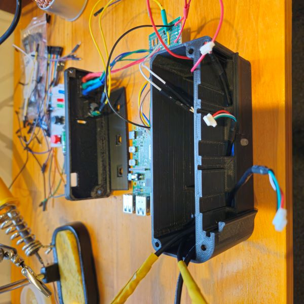
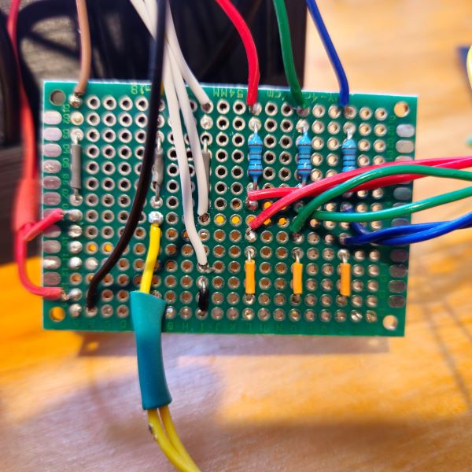
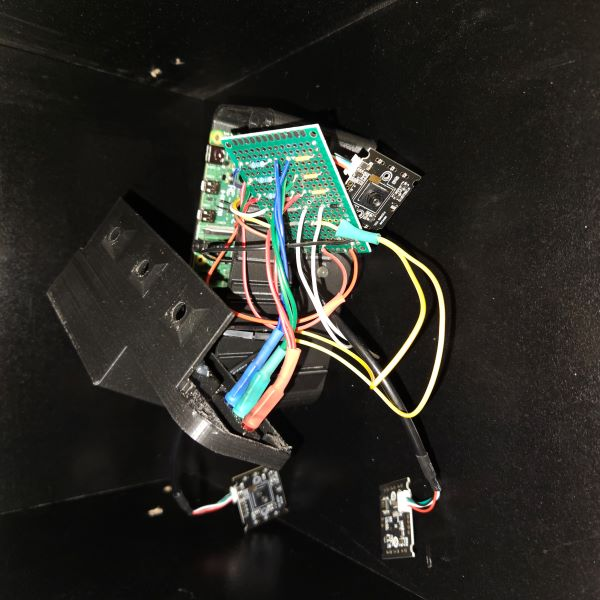

# Project Description
This project is creating a portable multi-lens camera using a Raspberry Pi 4 4GB with multiple USB cameras, housed in a custom 3D printed case supporting a small USB C Powerbank for portability.
Capturing a 3D/stereoscopic series of images which can then be merged to create a "wigglegram"; a gif that creates a 3D illusition which flips between the captured image frames indefinetly.

# Revision A
Originally tested a MVP with 3-4, 0.3MP USB cameras.
- **Raspberry Pi 2**: Unstable capture, with ~16,494ms delay using 3 cameras.
- **Raspberry Pi 3**: Unstable capture, with ~1,800ms delay using 3 cameras.
- **Raspberry Pi 400**: Stable capture, with ~1,200ms delay using 4 cameras.

<table>
  <tr><td colspan="2">Rev A Samples</td></tr>
  <tr>
    <td></td>
    <td></td>
  </tr>
</table>

# Revision B
- Added a python flask web server to view and download images in bulk.
- Upgraded to 3x fixed focus 2MP USB webcams
- Designed 3D housing, LEDS: flash (white), status (blue), success (green), failure (red), BUTTONS: Power on/off, shutter button
- Add support for USB Powerbank

<table>
  <tr><td colspan="4">Rev B build</td></tr>
  <tr>
    <td></td>
    <td></td>
    <td></td>
    <td></td>
  </tr>
</table>

<table>
  <tr><td colspan="3">Rev B Samples</td></tr>
  <tr>
    <td>Coming soon...</td>
  </tr>
</table>
