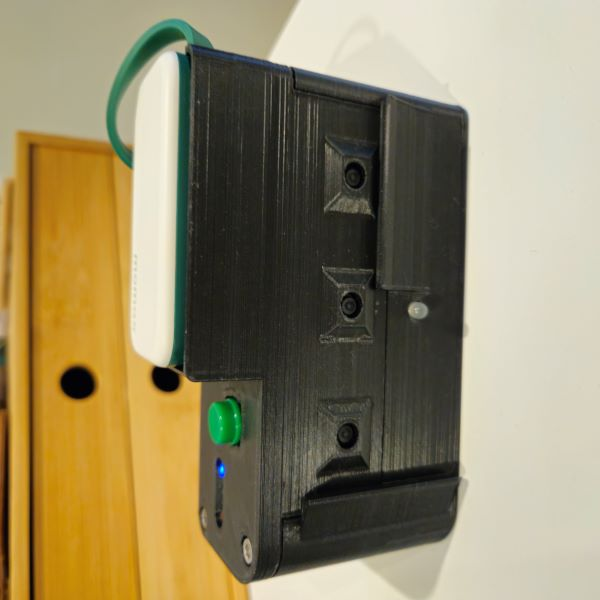

This project involves building a portable multi-lens camera using a Raspberry Pi and multiple USB cameras, all housed in a custom 3D-printed case. The setup includes a compact USB power bank for enhanced portability. The camera captures 3D/stereoscopic image series, which can be combined to create a "wigglegram" — an animated GIF that flips between frames to produce a dynamic 3D illusion.

## Revision B: Portable Build

### Hardware
- Upgraded to 3x fixed focus 2MP USB webcams (https://s.click.aliexpress.com/e/_m01QQuJ - variation: **90 degree fixed focus**)
- Add support for USB power bank (momax 1-Power Mini 5000mah)
- Designed & iterated through 3D printed housing with various case features
  - 4x LEDs, 2x Push switches
- Raspberry pi 4 4GB

### Features
- Python flask web server to view image sets and download sets in bulk
- LEDs:
  - flash (white)
  - status (blue)
  - success (green)
  - failure (red)
- Buttons:
  - 1. Shutter button
  - 2. Secondary button:
    - Push to toggle flash
    - Hold to turn pi off
    - Turn Pi on, when it's off
- Inactivity shutdown
- Turn flash on/off (White LED at front of camera, no resistor)

<table>
  <tr><th colspan="4">Rev B build</th></tr>
  <tr>
    <td></td>
    <td></td>
    <td></td>
    <td></td>
  </tr>
</table>

<table>
  <tr><th colspan="3">Rev B Samples</th></tr>
  <tr>
    <td>Coming soon...</td>
  </tr>
</table>

---

## Revision A: MVP Testing
Tested a minimum viable product using 3-4 USB cameras, each with a resolution of 0.3 MP.
- **Raspberry Pi 2**: Unstable capture, with ~16,494ms delay using 3 cameras.
- **Raspberry Pi 3**: Unstable capture, with ~1,800ms delay using 3 cameras.
- **Raspberry Pi 400**: Stable capture, with ~1,200ms delay using 4 cameras.

<table>
  <tr><th colspan="3">Rev A build</th></tr>
  <tr>
    <td></td>
    <td></td>
    <td></td>
  </tr>
</table>

<table>
  <tr><th colspan="2">Rev A Samples</th></tr>
  <tr>
    <td></td>
    <td></td>
  </tr>
</table>
