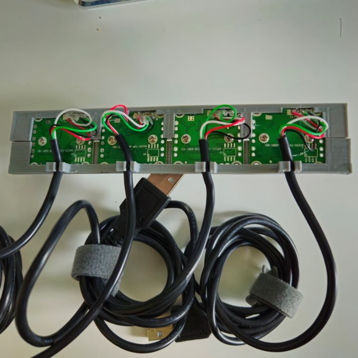
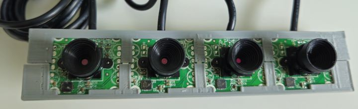
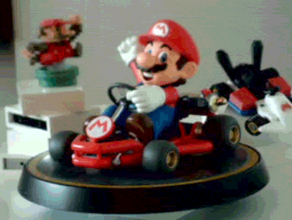
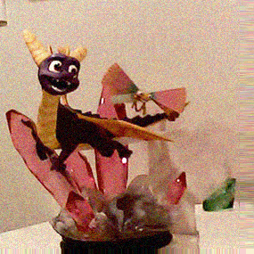

## Project Description
This was a 2-day project that involved building and testing a Raspberry Pi setup with up to four USB webcams to simultaneously capture digital images, with the end goal of creating wigglegrams by building a quadrascopic camera. The plan was to enclose the setup in a 3D-printed shell to align the cameras and investigate if the Raspberry Pi 2, 3 or 400 could handle the task.

## Cameras Used
- 4 (very) old 0.3MP USB webcams
- <table>
  <tr>
    <td style="text-align: center;">
      
      <p>4x Webcams in housing</p>
    </td>
    <td style="text-align: center;">
      
      <p>Printed enclosure (back view)</p>
    </td>
    <td style="text-align: center;">
      
      <p>Printed enclosure (front view)</p>
    </td>
  </tr>
</table>

- **ffmpeg** is used for capturing images from the webcams, instead of **libcamera**, which is typically used with the Raspberry Pi camera module.

## Raspberry Pi Models Tested
- **Raspberry Pi 2**: Unstable capture, with ~16,494ms delay using 3 cameras.
- **Raspberry Pi 3**: Unstable capture, with ~1,800ms delay using 3 cameras.
- **Raspberry Pi 400**: Stable capture, with ~1,200ms delay using 4 cameras.
```
Start time:                20:58:18.652384481
-- images/1730966298_A.jpg 20:58:19.548842429
-- images/1730966298_B.jpg 20:58:19.688841233
-- images/1730966298_C.jpg 20:58:19.720840960
-- images/1730966298_D.jpg 20:58:19.824840071
Elapsed time:              1193 ms
Success!
```

### Thoughts on the next iteration...
- Fixed-focus cameras (50-70° field of view) to mimic the 3D effect of Nintendo 3DS cameras, avoiding autofocus and manual adjustments to the lens.
- Experiment with camera spacing to enhance 3D depth perception.
- Develop a web interface for previewing and triggering captures.
- Explore portability requirements with battery power.

### wigglegrams created:




 ## Conclusion
 The raspberry pi 400 (4GB) can capture 4 very low res images (435x309px) within 0.276 seconds. Attempts to capture larger images can hang the CPU cores. Furthermore, the low quality web cams used meant that the focus was impossible to adjust to the same depth, resulting in a significant loss of detail when stitching them together to create the wigglegrams. 
